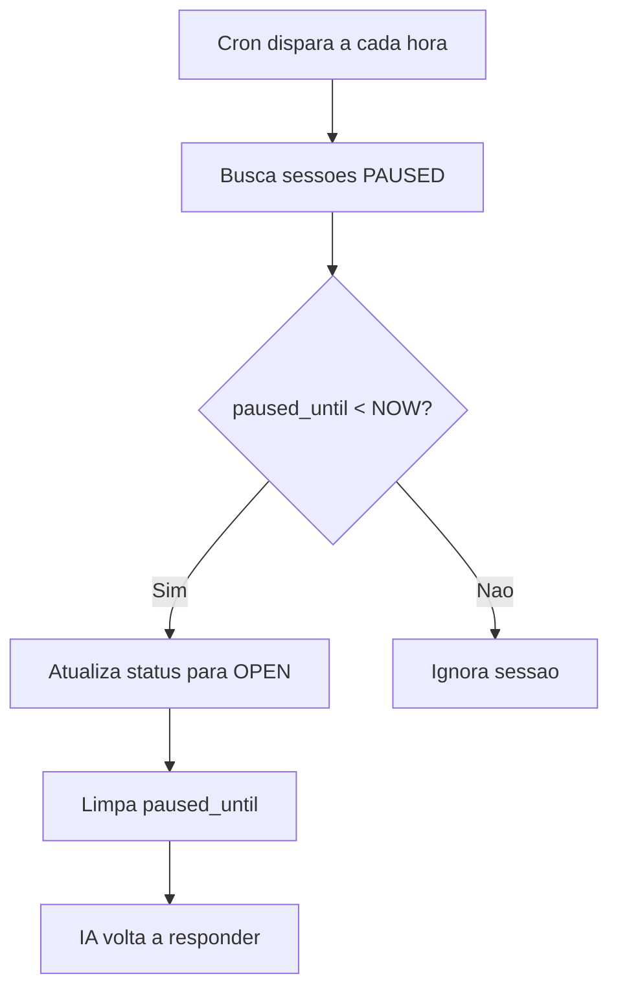

## Visao Geral

O job `cron_reabrir_sessoes` verifica sessoes com status `PAUSED` cuja data de expiracao (`paused_until`) ja passou e as reativa automaticamente.

## Configuracao

| Propriedade | Valor |
|-------------|-------|
| **Nome** | reabrir-sessoes |
| **Schedule** | `0 * * * *` (a cada hora) |
| **Funcao** | `cron_reabrir_sessoes()` |

---

## Funcao SQL

```sql
CREATE OR REPLACE FUNCTION cron_reabrir_sessoes()
RETURNS void AS $$
BEGIN
  UPDATE whatsapp.sessions
  SET
    status = 'OPEN',
    paused_until = NULL,
    updated_at = NOW()
  WHERE
    status = 'PAUSED'
    AND paused_until IS NOT NULL
    AND paused_until < NOW();

  -- Log quantidade atualizada
  RAISE NOTICE 'Sessoes reativadas: %', ROW_COUNT;
END;
$$ LANGUAGE plpgsql;
```

---

## Criar o Job

```sql
SELECT cron.schedule(
  'reabrir-sessoes',
  '0 * * * *',
  $$SELECT cron_reabrir_sessoes()$$
);
```

---

## Fluxo de Execucao



---

## Verificar Sessoes Pendentes

```sql
SELECT
  id,
  contact_id,
  status,
  paused_until,
  NOW() - paused_until as tempo_expirado
FROM whatsapp.sessions
WHERE
  status = 'PAUSED'
  AND paused_until < NOW();
```

---

## Executar Manualmente

```sql
SELECT cron_reabrir_sessoes();
```

<Warning>
  Quando uma sessao e reaberta, a IA volta a responder automaticamente. Certifique-se de que o atendimento humano foi concluido antes da expiracao.
</Warning>
