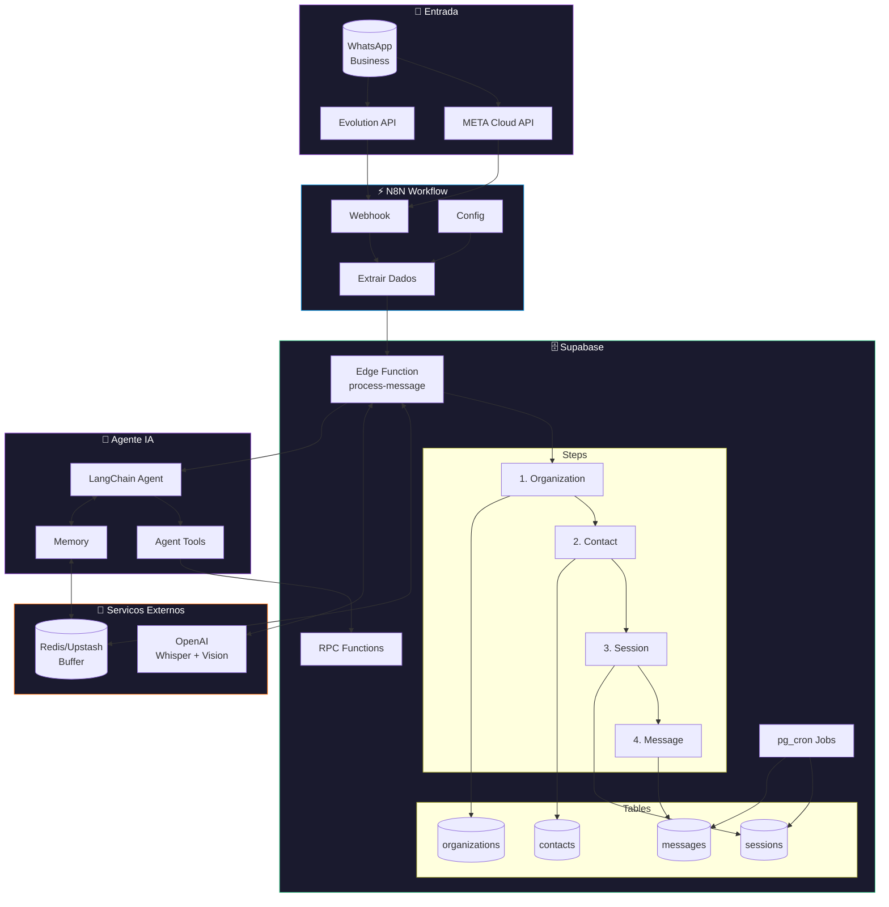

## Bem-vindo

Esta e a documentacao tecnica da **Orayon AI** - plataforma de automacao de atendimento via WhatsApp com inteligencia artificial.

---

## Comece Aqui

<CardGroup cols={2}>
  <Card title="Configurar Agente N8N" icon="rocket" href="/guides/n8n-agent/quickstart">
    Guia passo a passo para configurar o agente de WhatsApp no N8N
  </Card>
  <Card title="API Reference" icon="code" href="/api-reference/introduction">
    Documentacao completa das APIs, Edge Functions e RPCs
  </Card>
</CardGroup>

---

## Arquitetura

<Frame>

</Frame>

---

## Fluxo de Mensagem

<Steps>
  <Step title="Recebimento">
    WhatsApp envia webhook para N8N (META ou Evolution API)
  </Step>
  <Step title="Normalizacao">
    N8N extrai e normaliza dados no formato padrao
  </Step>
  <Step title="Processamento">
    Edge Function processa: Organization → Contact → Session → Message
  </Step>
  <Step title="Buffer">
    Redis agrupa mensagens consecutivas (7 segundos)
  </Step>
  <Step title="Transcricao">
    OpenAI Whisper transcreve audios para texto
  </Step>
  <Step title="Agente IA">
    LangChain processa e gera resposta inteligente
  </Step>
  <Step title="Resposta">
    Mensagem enviada de volta ao WhatsApp
  </Step>
</Steps>

---

## Principais Componentes

<CardGroup cols={3}>
  <Card title="Edge Function" icon="bolt" href="/api-reference/edge/arquitetura">
    Processa mensagens WhatsApp
  </Card>
  <Card title="Agent Tools" icon="wrench" href="/api-reference/rpc/get-lead">
    Funcoes RPC para o agente IA
  </Card>
  <Card title="Crons" icon="clock" href="/api-reference/crons/overview">
    Jobs agendados (pg_cron)
  </Card>
</CardGroup>

---

## Stack Tecnologico

<CardGroup cols={4}>
  <Card title="Supabase" icon="database">
    PostgreSQL + Edge Functions
  </Card>
  <Card title="N8N" icon="diagram-project">
    Workflow Automation
  </Card>
  <Card title="Redis" icon="bolt">
    Buffer + Cache
  </Card>
  <Card title="OpenAI" icon="brain">
    Whisper + GPT-4
  </Card>
</CardGroup>

---

## Links Uteis

- [Site Orayon](https://orayon.ai)
- [GitHub](https://github.com/orayonai)
- [Suporte](mailto:contato@orayon.com.br)
